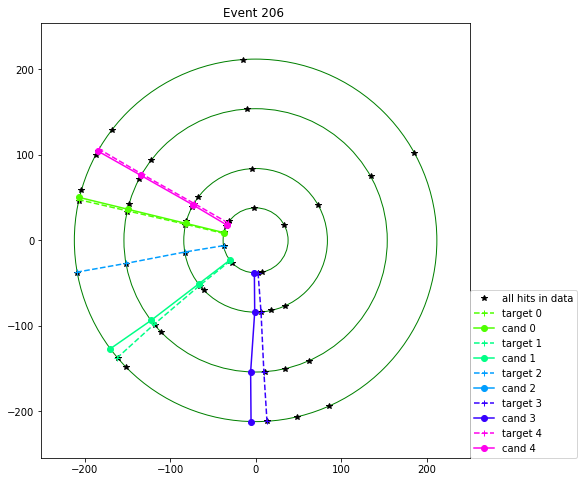

# A sequence to sequence tracking model

 The model presented here is adapted to the dataset proposed at the [RAMP](http://ramp.studio/) during [Connecting the Dots 2017](https://ctdwit2017.lal.in2p3.fr/). It takes in sequences of hits per layer and provides sequence of hits per track.
 The code in all in the ModelAndData.py file and there are a couple of notebook demonstrating how to use it.

## generating more data
The initial dataset contains only 5k events and we generate more in [this notebook](generate_data.ipynb).

## creating a model, convert data and train
The data in its original form has to be converted for the given model in [this notebook](train_model.ipynb)

## visualizing the performance
Once sufficiently trained, one can visualy inspect the performance of the model in [this notebook](visualize_prediction.ipynb)

In the image below the model is finding the hits belonging to the tracks from the sequences of this per layer.
